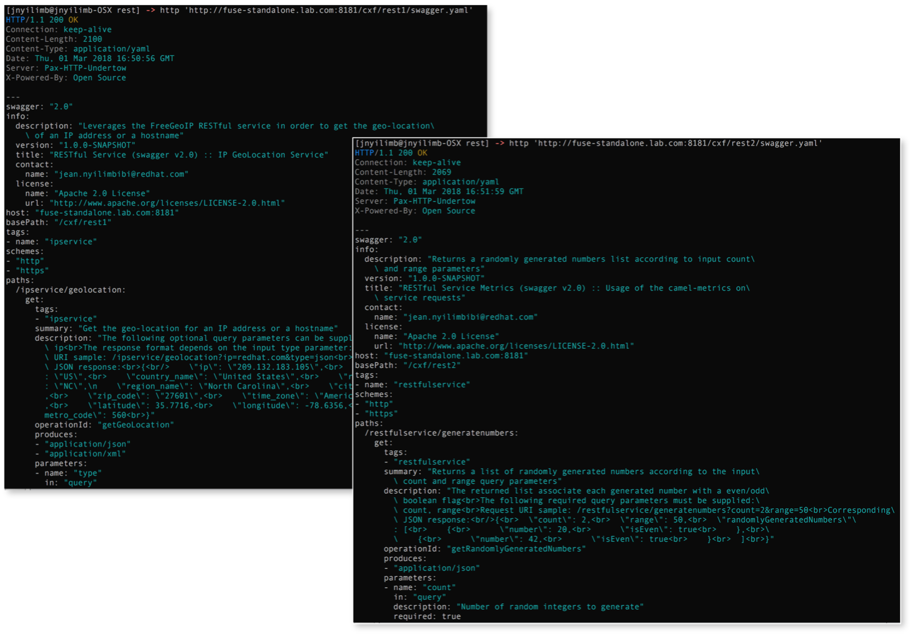
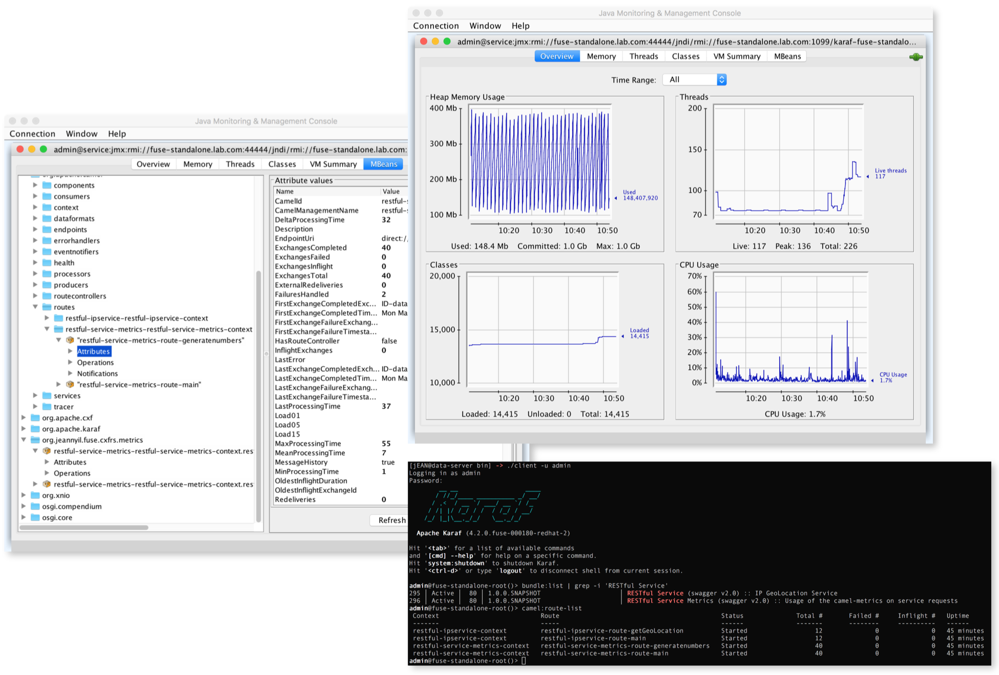

# Red Hat Fuse 7 Standalone on Apache Karaf Technical Preview :: RESTful services using the Apache Camel CXFRS component

This repository contains _**Red Hat Fuse 7 Standalone on Apache Karaf Technical Preview**_ 
projects that implement swagger 2.0-compliant RESTful 
services using the Apache Camel CXFRS component.
- _**[restful-ipservice](restful-ipservice)**_
- _**[restful-service-metrics](restful-service-metrics)**_

## :warning: WARNING:
- These projects are configured to use a repository manager. 
Thus, the [parent POM](pom.xml) points to my private [Sonatype Nexus Repository OSS](https://www.sonatype.com/download-oss-sonatype).
My [Sonatype Nexus Repository OSS](https://www.sonatype.com/download-oss-sonatype) is configured to proxy the following 
Red Hat maven repositories in addition to [Maven Central](https://repo1.maven.org/maven2):
  - https://maven.repository.redhat.com/ga 
  - https://maven.repository.redhat.com/earlyaccess/all
- Make sure you configure the [parent POM](pom.xml) to either point to
your own maven repository manager or directly to [Maven Central](https://repo1.maven.org/maven2) as well as
the two Red Hat maven repositories above.
- A couple of *PID* properties (```exposed.service.gateway.host``` and ```exposed.service.gateway.port```) have
to be adjusted according to your environment for a consistent swagger 2.0 spec generation:
  - either within the projects blueprint for local tests with ```camel:run``` maven goal.
    - [restful-ipservice blueprint](restful-ipservice/src/main/resources/OSGI-INF/blueprint/blueprint-bean.xml)
    - [restful-service-metrics blueprint](restful-service-metrics/src/main/resources/OSGI-INF/blueprint/blueprint-bean.xml)
  - either by creating the appropriate *PID* files to override default values at containr runtime (Red Hat Fuse 7 Apache Karaf)
 according to the deployed module:
    - ```org.jeannyil.fuse.restful-ipservice.cfg``` for [restful-ipservice](restful-ipservice)
    - ```org.jeannyil.fuse.restful-service-metrics.cfg``` for [restful-service-metrics](restful-service-metrics)

## Screenshot samples

### Requesting the swagger 2.0 spec 


### GET requests


### Metrics in JConsole and Fuse 7 Apache Karaf 4 console

